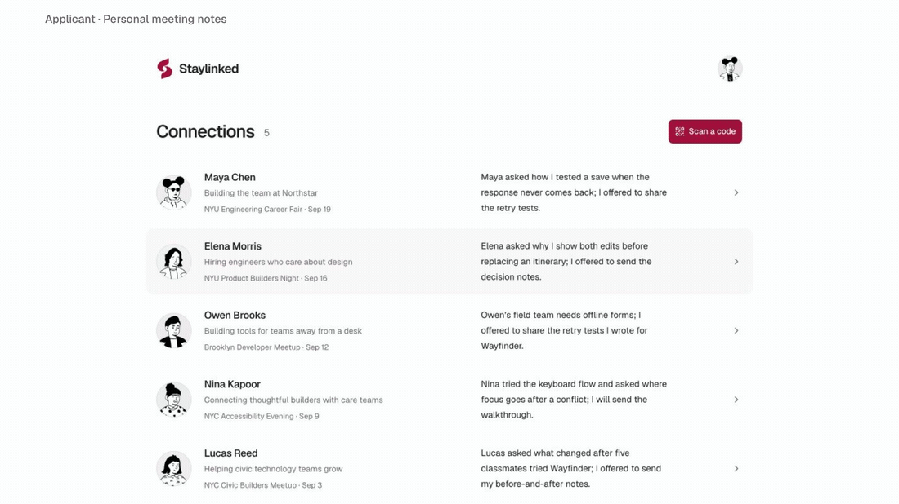
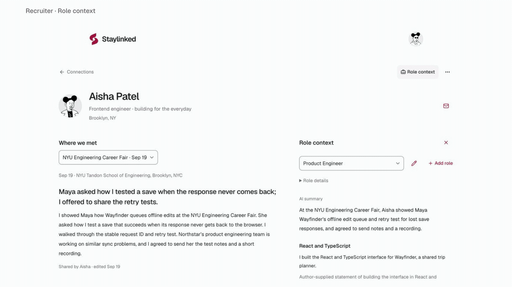

# Staylinked

Meeting someone gives a recruiter context that a resume alone does not carry. A month later, the detail that made that person memorable can be hard to recover. Staylinked explores how to preserve that detail alongside work the candidate can keep updating.

This is a full-stack web project built with React, TypeScript, Node.js, SQLite, and a small Rust passage matcher. A recruiter shares an event QR; the candidate writes the meeting note and shares their work. Both can revisit the relationship. A recruiter can also look at that work against a role, with quotations that open at their source. Contact stays with email, LinkedIn, and personal websites.

## Interface

The candidate keeps a specific memory of each meeting: the question someone asked, the work they discussed, and what they offered to share next. Repeat meetings belong to the same person. A separate meeting control changes the note while keeping the person's profile in place; the selected encounter survives a refresh.



Selecting a role opens relevant passages beside the meeting note. Each quotation links back to its source, where the selected text is highlighted.



These loops use screenshots of the running app with fictional profiles, composed in HyperFrames. A [24-second overview](docs/media/staylinked-ui-overview.mp4) is also available as a 1080p MP4.

Full-size screens: [candidate connections](docs/media/candidate-connections.jpg), [candidate profile](docs/media/candidate-profile.jpg), [meeting selection](docs/media/meeting-menu.jpg), [role context](docs/media/role-context.jpg), and [source inspection](docs/media/source-quotation.jpg).

## Decisions in the code

Express owns sessions, access checks, extraction, and persistence. SQLite and a private upload directory keep the application in one process, with a short-lived Rust subprocess for passage lookup. The [architecture guide](docs/architecture.md) follows the data and explains the tradeoffs.

| Problem                                                        | Implementation                                                                                                                                                                             | Where to read                                                                                           |
| -------------------------------------------------------------- | ------------------------------------------------------------------------------------------------------------------------------------------------------------------------------------------ | ------------------------------------------------------------------------------------------------------- |
| A person and a meeting have different lifetimes.               | Profiles and work stay current; each encounter keeps its own editable note and original note text. Meeting selection is encoded in the URL.                                                | [Encounter UI](src/EncounterNote.tsx), [records](server/db.mjs)                                         |
| A private response may finish after access or content changes. | The API rechecks the connection, role, recap, profile, and sources after awaiting a lookup. Client requests also guard against account changes across tabs.                                | [API](server/app.mjs), [request helper](src/api.ts)                                                     |
| Replacing a document can fail halfway through.                 | Extract and validate before replacing; compare the stored version after extraction; preserve the previous file if saving fails. Deletion removes access before cleaning up bytes.          | [Material lifecycle](docs/architecture.md#material-lifecycle), [failure tests](tests/workflow.test.mjs) |
| One candidate's work does not need a search service.           | Rust finds deterministic whole-word matches in bounded text and returns exact passages. Node applies process limits and validates the output.                                              | [Rust library](rust/src/lib.rs), [Node boundary](server/evidence.mjs)                                   |
| A model can invent a source or become unavailable.             | Validate requirement coverage, source IDs, and exact quotations. Cache valid results by their inputs; fall back to local passages on failure.                                              | [Model adapter](server/briefs.mjs)                                                                      |
| Small controls can make a simple workflow confusing.           | Shared shadcn/Base UI controls provide keyboard and focus behavior. Event metadata stays readable; changing meetings is an explicit action. Garnet colors have gated Display-P3 overrides. | [Interface](docs/design-system.md), [components](src/components/ui)                                     |

Rust is an exercise in borrowed text slices, Serde types, `Result` handling, and a bounded language boundary. Process startup adds overhead; no speed advantage over JavaScript has been measured. A persistent index would introduce synchronization for a lookup that only needs one person's current work.

Profiles and files are available through authenticated connections. Either person can remove an encounter; another encounter between the same pair may still grant access. There is no public directory, chat system, candidate score, or automated outreach.

## Run locally

Requires **Node.js 24+**, npm, and a stable [Rust toolchain](https://rustup.rs/) with Cargo.

```sh
npm ci
npm run dev
```

Open [localhost:5173](http://localhost:5173). Recruiter and candidate demo accounts use fictional data. Use separate browsers for independent sessions; switching accounts replaces the current browser session.

```sh
npm run build   # Rust release binary + TypeScript + Vite
npm start       # serve the built application
npm run check   # build, Rust tests/fmt/Clippy, HTTP workflow tests
npm run smoke   # built app, temporary data, no provider key
npm run format:check
```

No model key is required. Records persist in `data/again.sqlite`, with files in `data/uploads/`. These paths and `.env` are ignored by Git. Set `DATA_DIR` for a separate instance. `DEMO_MODE=false` disables demo access and seed creation for a new database without erasing existing records.

To walk through the project, enter as the recruiter, open Aisha Patel, and choose **View for a role**. Open a quotation to inspect its source. Use the account menu to switch to the applicant and see the same meeting from the other side. QR invitations also support a camera or image upload in the browser.

See [development and troubleshooting](docs/development.md) for fresh sample data, isolated instances, targeted checks, and setup recovery.

## Optional model adapter

The OpenCode Go adapter uses an OpenAI-compatible Chat Completions endpoint. Copy `.env.example` to `.env` and configure the server:

```dotenv
OPENCODE_API_KEY=your-key-here
OPENCODE_BASE_URL=https://opencode.ai/zen/go/v1
OPENCODE_MODEL=glm-5.3
```

The model must support `/chat/completions`; see the [provider documentation](https://opencode.ai/docs/go/). Restart the server after changing `.env`. A role lookup sends bounded source excerpts. The server validates source IDs, exact quotations, and requirement coverage, then caches valid results. Invalid responses, provider failures, and timeouts fall back to local Rust matches. The model cannot modify records or contact people.

Run `npm run provider:check` after building to make one live request with the fictional Aisha/Product Engineer fixture, validate its quotations, and verify the second lookup uses the cache. This opt-in check consumes provider usage; normal tests use controlled responses. It prints only status metadata. Provider latency and cost are not benchmarked.

## Verification and limits

Rust tests cover exact passages, whole-word boundaries, normalization, deterministic ties, negation, and input limits. HTTP tests use isolated databases and upload directories to cover sessions, QR destinations, persistence, ownership, file access, access revocation, role lookup, and the provider adapter. Client tests cover account changes, request deadlines, cancellation, and malformed responses using controlled fetches and clocks.

| Failure case                                  | Behavior covered by tests                                                                              |
| --------------------------------------------- | ------------------------------------------------------------------------------------------------------ |
| A replacement file fails validation or saving | The previous document and record remain available.                                                     |
| Two file replacements overlap                 | A stale replacement is rejected before it can overwrite the newer version.                             |
| Deleting a file fails at the database         | The record and downloadable bytes remain intact.                                                       |
| Work or a profile changes during lookup       | The pending result is rejected; a new lookup reads the current inputs.                                 |
| Another tab changes the signed-in account     | Requests carrying the earlier account identity are rejected, and stale client responses are discarded. |

[CI](.github/workflows/check.yml) also exercises the production entry with an empty temporary data directory, no model key, and a dynamically selected port. It verifies built assets, demo login, and exact Rust citations, then removes its data and process. Startup fails before opening the database when required build artifacts are missing.

This is a local development project. Demo accounts are shared. Email verification, password reset, malware scanning, OCR, pagination, and production deployment are outside the current implementation. Recaps and profiles are author supplied; a QR submission does not verify attendance. Literal word matches can miss synonyms or include negated claims. A citation identifies its source, not its truth.

- [Scope](docs/product.md)
- [Trust, encounter context, and existing tools](docs/trust-and-context.md)
- [Architecture](docs/architecture.md)
- [Development](docs/development.md)
- [Interface and avatar credits](docs/design-system.md)

Started at [Trust in the Hiring Funnel](https://devpost.com/software/staylinked) by Prashant Shah and Daniel Rajakumar. The repository continues as a portfolio project after the hackathon. The [submitted recording](https://www.loom.com/share/e1de375352b4417c8c3c828df3dc22ad) shows the original build.
