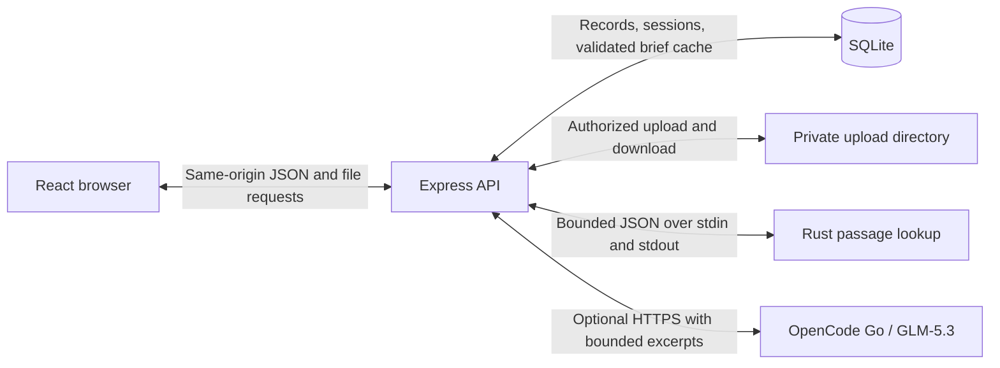

# Architecture

Staylinked is one React client and one Express process, backed by SQLite and local files. Node owns authentication, authorization, extraction, and persistence. A short-lived Rust executable finds source passages; an optional model request organizes those passages for a selected role.

[Server entry](../server/index.mjs) serves the built client in production and uses Vite middleware during development. The browser never receives provider credentials or direct filesystem paths.

## Records and access

The [SQLite schema](../server/db.mjs#L18) combines JSON records with ownership columns, foreign keys, and connection/material indexes. Recruiters own events and roles; candidates own materials; both edit their own profiles. A unique candidate/event pair identifies an encounter. Its current recap can change while `originalConversation` preserves the first submission.

The [portal](../server/app.mjs#L335) exposes event metadata and a limited recruiter introduction, plus the signed-in candidate's existing recap when present. Private account routes return connected profiles. A recruiter can read a candidate's files only while a connection grants access. [Removing one encounter](../server/app.mjs#L390) leaves profiles and work intact; another encounter between the same people can retain access. There is no public profile directory.

[CSV export](../server/app.mjs#L571) checks ownership of every selected connection. Its [serializer](../server/workflow.mjs) quotes cells and prefixes formula-like values. This is a manual export, not an ATS integration. Contact links open supplied email or web destinations; the server sends no outreach.

## Requests and changing data

Sessions use hashed tokens in SQLite and HTTP-only cookies; passwords use salted scrypt. The [server identity guard](../server/app.mjs#L166) compares `X-Staylinked-User` with the authenticated account. It prevents a form rendered for one account from reading or mutating another after a shared browser cookie changes. The header supplements authentication; it does not grant access.

The [client request helper](../src/api.ts#L25) rejects responses when its known account changes, including during body reading. [Session refresh](../src/auth.tsx#L18) runs on focus and visibility changes; [route keys](../src/App.tsx#L14) reset private component state across accounts and invitations.

JSON and Blob reads share a 30-second deadline. Earlier caller cancellation takes priority. There are no automatic retries: a timed-out or unreadable mutation response may follow a successful write, so the error asks the user to refresh before retrying. Cancelling a client request does not roll back a server write. [Downloads](../src/downloads.ts#L7) use this same helper, report errors inside the app, and release temporary object URLs.

After an awaited role lookup, the [API rechecks](../server/app.mjs#L606) connection access, role, recap version, full profile, and sources. Removed access or changed inputs, including [name-only edits](../tests/workflow.test.mjs#L1223), prevent the stale response from returning private passages.

## Material lifecycle

Candidates can keep up to 20 materials. Uploads accept one PDF, TXT, or Markdown file, up to 8 MiB. [Extraction](../server/app.mjs#L65) reads the first 30 PDF pages and retains up to 60,000 text code units. A PDF without extractable text remains downloadable; OCR is not implemented.

[Replacement](../server/app.mjs#L476) preserves the material ID and creation date. It extracts first, then compares the current stored row with the one read before extraction, rejecting concurrent replacement or deletion. Validation or PDF parsing failure leaves the old document intact.

[Persistence](../server/app.mjs#L419) writes a new uniquely named file before updating SQLite. A failed database write triggers cleanup of that new file; the old file is removed only after the update succeeds. This handles ordinary failures, but the filesystem and database do not share a crash-atomic transaction. Files default to `data/uploads`, outside the static client directory. Every [download](../server/app.mjs#L502) checks ownership or a current recruiter connection.

[Deletion](../server/app.mjs#L539) commits the database removal before unlinking. [Failure tests](../tests/workflow.test.mjs#L1174) verify that failed database writes preserve the file; failed cleanup leaves private bytes unreachable through the API.

## Why a small Rust lookup

A lookup concerns one person's recap, bio, and at most 20 materials, not a large searchable corpus. [Source assembly](../server/briefs.mjs#L55) provides the current text on demand. A persistent index would add synchronization and operational work without being necessary for this bounded task.

The [Rust library](../rust/src/lib.rs#L124) accepts 1–12 requirements and at most 22 sources, with 200 characters per requirement and 18,000 per source. It borrows sentence/line slices, tokenizes whole words, removes stop words, and applies a small explicit vocabulary. Greater term coverage wins, then passages of at least nine words; work wins remaining ties against recap/bio, followed by stable source order. Unmatched requirements return null source and quotation.

Canonical short technical names and contextual `Go` matching avoid some false positives; conservative rules also miss valid wording. Negated claims can match. The output identifies text, not competence.

Rust makes ownership, borrowed slices, Serde types, and `Result` boundaries explicit. The [Node wrapper](../server/evidence.mjs#L12) uses `execFile` without a shell, with 2 MB input, a three-second timeout, and a 1 MB output limit. It revalidates requirement order, source IDs, and exact quotations. There is no retrieval service, network client, or persistent index in the executable. Process startup adds overhead; no speed advantage has been measured.

## Optional model boundary

[Brief construction](../server/briefs.mjs#L149) runs Rust first, even on a model-cache hit. Without a key it returns that local result. Otherwise, excerpt selection limits context to 40,000 code units overall and 4,500 per source. GLM-5.3 requests use `reasoning_effort: low`, a client user agent, and an opaque encounter/role session hash.

[Validation](../server/briefs.mjs#L103) requires every role requirement exactly once and checks quotations against both full sources and the actual excerpts. Cache keys include profile, encounter content, role, sources, model, and endpoint. Provider errors, invalid output, or the 25-second deadline return local matches with a fallback notice. The model has no tools or write actions. Exact citation checks establish provenance, not factual truth or summary accuracy.

## Verification and limits

[Workflow tests](../tests/workflow.test.mjs) exercise ownership, revocation during lookup, concurrent uploads, replacement failures, cache invalidation, and CSV handling. [Client tests](../tests/api.test.mjs) cover account switches, deadlines, cancellation, and Blob errors. [Rust tests](../rust/src/lib.rs#L205) cover deterministic exact passages and vocabulary limits.

The [QR parser](../src/lib/qr.ts) extracts only a safe event ID; the [scanner](../src/ScanQR.tsx#L91) resolves it against the local portal, never the encoded host. Camera capture requires explicit activation and a secure context. Cleanup stops media tracks, pending lookups, animation frames, and image URLs, including late permission grants. [Parser tests](../tests/qr.test.mjs) cover malformed and external URLs; physical-camera behavior remains untested.

The opt-in [provider check](../scripts/provider-check.mjs) uses fictional in-memory fixtures to validate citations and cache reuse. Production scale, latency, and cost are unmeasured. SQLite/file operations are synchronous, lists lack pagination, and shared demo accounts are unsuitable for private information. QR submissions do not verify attendance or identity.
